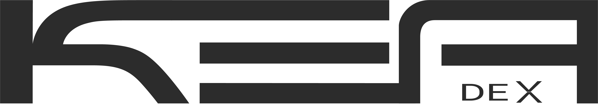

  

<i>Experiment. Learn. Share.</i>

 

> [!IMPORTANT]
> Maintaining open-source solutions demands significant effort, especially since it’s not my primary job. However, Keadex is my passion, and I genuinely enjoy working on it.
>
> If you appreciate Keadex applications or libraries, I’m not asking for a coffee or a donation. 
> Instead, simply ⭐ **star** this repository and 📣 **share** it with your teams, colleagues, or community!

## Introduction

**Keadex** is a project that aims to **experiment**, **learn** and provide **open source** solutions.

Some of the packages in this repo are experiments ( :microscope: ), some under development ( :hourglass_flowing_sand: ), while others are ready to use open source solutions ( :white_check_mark: ).

💡 Do you have ideas you’d like to share? Are you interested in contributing to Keadex or learning more about it?
Feel free to reach out to me on my [Discord channel](https://discord.gg/utCqK9jzJW), or explore the Keadex [website](https://keadex.dev) and [documentation](https://keadex.dev/docs) for more information!

## Packages

### Applications

| Type               | Package                                                                                         | Short Description                                                | Version                                                                                                                                                               | Language(s)      | Framework(s)                  |
| ------------------ | ----------------------------------------------------------------------------------------------- | ---------------------------------------------------------------- | --------------------------------------------------------------------------------------------------------------------------------------------------------------------- | ---------------- | ----------------------------- |
| :white_check_mark: | [apps/keadex-battisti](https://github.com/keadex/keadex/tree/main/apps/keadex-battisti)         | Keadex Website & Documentation Platform.                         |      | Typescript, MDX  | Next.js, Nextra, Tailwing CSS |
| :white_check_mark: | [apps/keadex-diagrams](https://github.com/keadex/keadex/tree/main/apps/keadex-diagrams)         | Keadex architectural diagrams.                                   |         | PlantUML, JSON   | Keadex Mina                   |
| :white_check_mark: | [apps/keadex-mina](https://github.com/keadex/keadex/tree/main/apps/keadex-mina)                 | Desktop app to create and manage C4 Model diagrams.              |          | Typescript, Rust | Tauri, React, Tailwind CSS    |
| :white_check_mark: | [apps/mina-confluence-app](https://github.com/keadex/keadex/tree/main/apps/mina-confluence-app) | Custom Confluence UI integrated into the Confluence Mina plugin. |  | Typescript       | React, Atlassian Forge        |

### Libraries

| Type               | Package                                                                                               | Short Description                                                                          | Version                                                                                                                                                                                                                 | Language(s)      | Framework(s)        |
| ------------------ | ----------------------------------------------------------------------------------------------------- | ------------------------------------------------------------------------------------------ | ----------------------------------------------------------------------------------------------------------------------------------------------------------------------------------------------------------------------- | ---------------- | ------------------- |
| :white_check_mark: | [libs/c4-model-ui-kit](https://github.com/keadex/keadex/tree/main/libs/c4-model-ui-kit)               | Library that provides UI components to render C4 Model diagrams.                           |                                                        | Typescript       | Fabric.js           |
| :white_check_mark: | [libs/docusaurus-plugin-mina](https://github.com/keadex/keadex/tree/main/libs/docusaurus-plugin-mina) | Library that provides the plugin to render Keadex Mina diagrams into Docusaurus.           |                                                 | Typescript       | React, Docusaurus   |
| :white_check_mark: | [libs/keadex-nx-plugin](https://github.com/keadex/keadex/tree/main/libs/keadex-nx-plugin)             | Library that provides the Nx plugin with Keadex executors and generators.                  |                                                       | Typescript       | Nx                  |
| :white_check_mark: | [libs/keadex-ui-kit](https://github.com/keadex/keadex/tree/main/libs/keadex-ui-kit)                   | Library that provides UI components to render Keadex applications.                         |                                                          | Typescript       | React, Tailwind CSS |
| :white_check_mark: | [libs/keadex-utils](https://github.com/keadex/keadex/tree/main/libs/keadex-utils)                     | Library that provides general purpose utilities.                                           |                                                           | Typescript       |                     |
| :white_check_mark: | [libs/mina-confluence-plugin](https://github.com/keadex/keadex/tree/main/libs/mina-confluence-plugin) | Library that provides the Confluence Macro to render Keadex Mina diagrams into Confluence. |                                                 | Typescript       | Atlassian Forge     |
| :white_check_mark: | [libs/mina-cli](https://github.com/keadex/keadex/tree/main/libs/mina-cli)                             | Library that provides the CLI to interact with Mina projects.                              |  | Rust             |                     |
| :white_check_mark: | [libs/mina-react](https://github.com/keadex/keadex/tree/main/libs/mina-react)                         | Library that provides a React component to include Keadex Mina diagrams into React apps.   |                                                             | Typescript, WASM | React, Tailwind CSS |

## Examples

> [!WARNING]  
> Examples are not part of the Yarn workspace.
> Befor running an example make sure to install the dependencies (`yarn install`) in the root folder of the example.

| Package                                                                                                         | Description                                                                                                                                                                                                                                                     |
| --------------------------------------------------------------------------------------------------------------- | --------------------------------------------------------------------------------------------------------------------------------------------------------------------------------------------------------------------------------------------------------------- |
| [examples/mina-react-example](https://github.com/keadex/keadex/tree/main/examples/mina-react-example)           | Example to demonstrate how to integrate the [Mina React](https://github.com/keadex/keadex/tree/main/libs/mina-react) component to render interactive C4 Model diagrams created with [Keadex Mina](https://github.com/keadex/keadex/tree/main/apps/keadex-mina). |
| [examples/mina-docusaurus-example](https://github.com/keadex/keadex/tree/main/examples/mina-docusaurus-example) | Example to demonstrate how to include in [Docusaurus](https://docusaurus.io) pages, interactive C4 Model diagrams created with [Keadex Mina](https://github.com/keadex/keadex/tree/main/apps/keadex-mina).                                                      |

## Get Started

This is a monorepo managed with [Nx](https://nx.dev/).

To start working on it:

- clone the repo: `git clone https://github.com/keadex/keadex.git`
- install the dependencies: `yarn`
- check the `project.json` file of each application or library for the list of the available Nx targets (commands can be executed - e.g. `yarn nx dev keadex-mina`)
