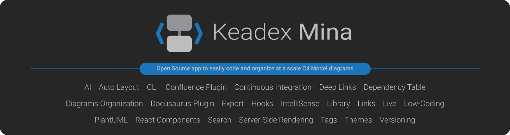

  

 

## Quick Overview

**Keadex Mina** is an application available for Linux, macOS, Windows, and the web.

It is based on the **Diagram as Code** concept: you can diagram software architectures by using [C4 Model PlantUML](https://github.com/plantuml-stdlib/C4-PlantUML) code and adjust the rendered result.

Mina is designed to be used in large projects and provides features to organize your diagrams.

  

## Download

Download the latest version from the [release](https://github.com/keadex/keadex/releases) section or from [keadex.dev](https://keadex.dev/en/projects/keadex-mina).

## Web Version

Keadex Mina is also available for the web: [Keadex Mina Live](http://keadex.dev/en/mina-live).

## Roadmap

Discover the upcoming and planned features [here](https://github.com/users/keadex/projects/2).

## Documentation

Discover all the features and details in the [Keadex Mina documentation](https://keadex.dev/en/docs/mina/introduction).

## Useful Links

- [C4 Model](https://c4model.com/)
- [PlantUML documentation](https://plantuml.com/)
- [C4 Model PlantUML Syntax](https://github.com/plantuml-stdlib/C4-PlantUML)
