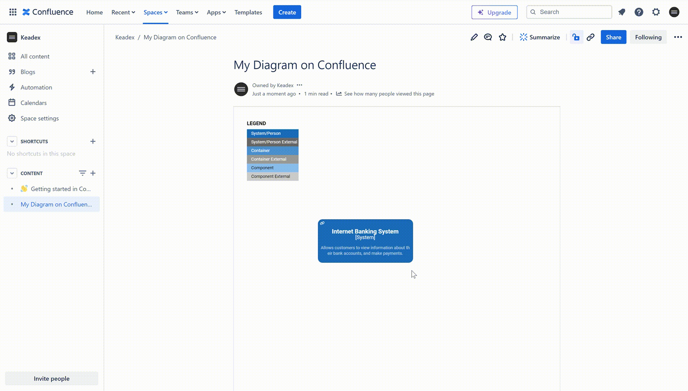

  

[](https://developer.atlassian.com/console/install/592fbf5b-017b-4db1-b3db-3cdced81f381?signature=AYABeFOcO3X9UhuQ8LY1iwZOWQ4AAAADAAdhd3Mta21zAEthcm46YXdzOmttczp1cy1lYXN0LTE6NzA5NTg3ODM1MjQzOmtleS83ZjcxNzcxZC02OWM4LTRlOWItYWU5Ny05MzJkMmNhZjM0NDIAuAECAQB4KZa3ByJMxgsvFlMeMgRb2S0t8rnCLHGz2RGbmY8aB5YBhV%2F%2FRtSUdEqYNw%2FkYNVEogAAAH4wfAYJKoZIhvcNAQcGoG8wbQIBADBoBgkqhkiG9w0BBwEwHgYJYIZIAWUDBAEuMBEEDOM%2B2dszhXcpPfdmDAIBEIA7vJ0tyajsNfTDJWZ0mKr2u4kglGh6JjJ%2FwmovyoYjCEDF7NZkZaAwBdAid%2FqYFiRlDSnOstV0jcH%2BQoYAB2F3cy1rbXMAS2Fybjphd3M6a21zOmV1LXdlc3QtMTo3MDk1ODc4MzUyNDM6a2V5LzU1OWQ0NTE2LWE3OTEtNDdkZi1iYmVkLTAyNjFlODY4ZWE1YwC4AQICAHhHSGfAZiYvvl%2F9LQQFkXnRjF1ris3bi0pNob1s2MiregHZQgH2ySEpmjnqXtqMROeVAAAAfjB8BgkqhkiG9w0BBwagbzBtAgEAMGgGCSqGSIb3DQEHATAeBglghkgBZQMEAS4wEQQMA6nGuJYUSlWN8CMjAgEQgDulL96Lb2IL59NzI7EDhYt4mKj9kKo%2FdEu6%2BD4FR9sfYL04KneIdjE9R%2FEdTnfoIyj61ZBzN2O9%2BWwV3AAHYXdzLWttcwBLYXJuOmF3czprbXM6dXMtd2VzdC0yOjcwOTU4NzgzNTI0MzprZXkvM2M0YjQzMzctYTQzOS00ZmNhLWEwZDItNDcyYzE2ZWRhZmRjALgBAgIAePadDOCfSw%2BMRVmOIDQhHhGooaxQ%2FiwGaLB334n1X9RCAR%2BtR%2Bz%2FThkM8Dpe9PpdwykAAAB%2BMHwGCSqGSIb3DQEHBqBvMG0CAQAwaAYJKoZIhvcNAQcBMB4GCWCGSAFlAwQBLjARBAwyQg9bT3kLp38NNg4CARCAO8Rr5ip54%2BmYNDzG9P%2BfV9OZ%2FcfnO4E2Gr2%2FxxWALiVI%2Bhc6lxl5OMkrqqyoUfbSHhSgyGeUKMAsDwtNAgAAAAAMAAAQAAAAAAAAAAAAAAAAAAxG8%2BgJCxgWwkCM68CO0Zf%2F%2F%2F%2F%2FAAAAAQAAAAAAAAAAAAAAAQAAADIOsM08zW6nuPOQaEWWJBHkkCcStRJnHona3N45vwZs%2FI%2FDeaTF58OSuVEcWIXAnq040F7%2BTQ2Di%2ByPMvoC1Hi9Z6Q%3D&product=confluence)

## Quick Overview

**Keadex Mina Confluence** is a library that provides the [Confluence plugin (macro)](https://developer.atlassian.com/console/install/592fbf5b-017b-4db1-b3db-3cdced81f381?signature=AYABeFOcO3X9UhuQ8LY1iwZOWQ4AAAADAAdhd3Mta21zAEthcm46YXdzOmttczp1cy1lYXN0LTE6NzA5NTg3ODM1MjQzOmtleS83ZjcxNzcxZC02OWM4LTRlOWItYWU5Ny05MzJkMmNhZjM0NDIAuAECAQB4KZa3ByJMxgsvFlMeMgRb2S0t8rnCLHGz2RGbmY8aB5YBhV%2F%2FRtSUdEqYNw%2FkYNVEogAAAH4wfAYJKoZIhvcNAQcGoG8wbQIBADBoBgkqhkiG9w0BBwEwHgYJYIZIAWUDBAEuMBEEDOM%2B2dszhXcpPfdmDAIBEIA7vJ0tyajsNfTDJWZ0mKr2u4kglGh6JjJ%2FwmovyoYjCEDF7NZkZaAwBdAid%2FqYFiRlDSnOstV0jcH%2BQoYAB2F3cy1rbXMAS2Fybjphd3M6a21zOmV1LXdlc3QtMTo3MDk1ODc4MzUyNDM6a2V5LzU1OWQ0NTE2LWE3OTEtNDdkZi1iYmVkLTAyNjFlODY4ZWE1YwC4AQICAHhHSGfAZiYvvl%2F9LQQFkXnRjF1ris3bi0pNob1s2MiregHZQgH2ySEpmjnqXtqMROeVAAAAfjB8BgkqhkiG9w0BBwagbzBtAgEAMGgGCSqGSIb3DQEHATAeBglghkgBZQMEAS4wEQQMA6nGuJYUSlWN8CMjAgEQgDulL96Lb2IL59NzI7EDhYt4mKj9kKo%2FdEu6%2BD4FR9sfYL04KneIdjE9R%2FEdTnfoIyj61ZBzN2O9%2BWwV3AAHYXdzLWttcwBLYXJuOmF3czprbXM6dXMtd2VzdC0yOjcwOTU4NzgzNTI0MzprZXkvM2M0YjQzMzctYTQzOS00ZmNhLWEwZDItNDcyYzE2ZWRhZmRjALgBAgIAePadDOCfSw%2BMRVmOIDQhHhGooaxQ%2FiwGaLB334n1X9RCAR%2BtR%2Bz%2FThkM8Dpe9PpdwykAAAB%2BMHwGCSqGSIb3DQEHBqBvMG0CAQAwaAYJKoZIhvcNAQcBMB4GCWCGSAFlAwQBLjARBAwyQg9bT3kLp38NNg4CARCAO8Rr5ip54%2BmYNDzG9P%2BfV9OZ%2FcfnO4E2Gr2%2FxxWALiVI%2Bhc6lxl5OMkrqqyoUfbSHhSgyGeUKMAsDwtNAgAAAAAMAAAQAAAAAAAAAAAAAAAAAAxG8%2BgJCxgWwkCM68CO0Zf%2F%2F%2F%2F%2FAAAAAQAAAAAAAAAAAAAAAQAAADIOsM08zW6nuPOQaEWWJBHkkCcStRJnHona3N45vwZs%2FI%2FDeaTF58OSuVEcWIXAnq040F7%2BTQ2Di%2ByPMvoC1Hi9Z6Q%3D&product=confluence) to render interactive C4 Model diagrams created with Keadex Mina into Atlassian Confluence pages.

  

## Documentation

If you are interested on the details of this package, please visit the [Mina Confluence documentation](TODO).
