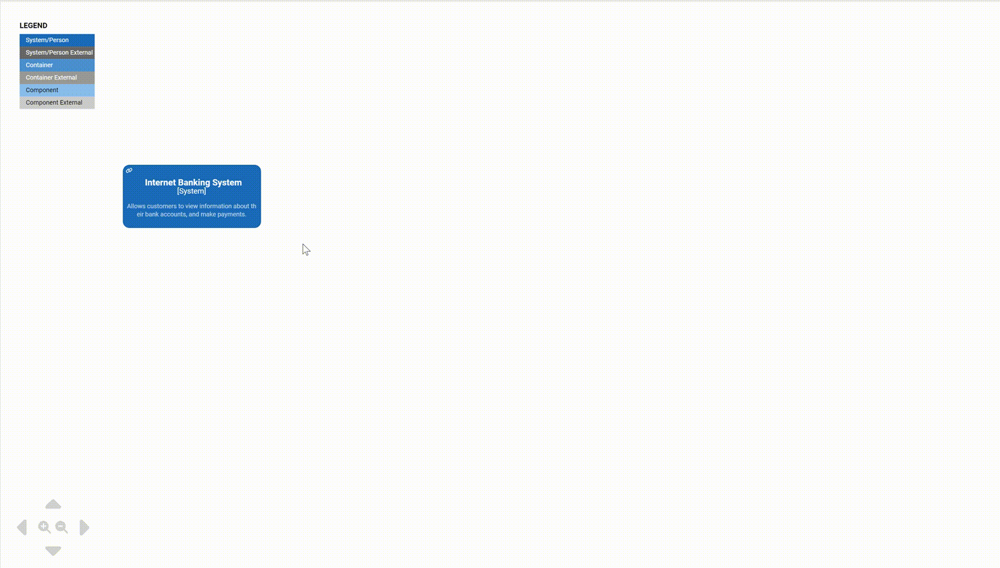

<p align="center">
  
</p>

<div align="center">


[](https://www.npmjs.com/package/@keadex/mina-react)

</div>

## Quick Overview

**Keadex Mina React** is a library that provides React components to render interactive C4 Model diagrams created with [Keadex Mina](https://keadex.dev/en/projects/keadex-mina).

<div align="center" style="margin-top: 20px">
  
</div>

## Usage

### Install

```shell
yarn add @keadex/mina-react # or npm install @keadex/mina-react
```

### Import

> [!WARNING]  
> Make sure to include also the css file from `@keadex/mina-react/main.css`

`App.jsx`

```JSX
import '@keadex/mina-react/main.css'
import MinaReact from '@keadex/mina-react'

export function App() {
  return (
    <div className="w-full h-screen">
      <MinaReact
        projectRootUrl="https://raw.githubusercontent.com/keadex/keadex/main/examples/mina-react-example/demo_mina_project/Mina%20Demo"
        diagramUrl="https://raw.githubusercontent.com/keadex/keadex/main/examples/mina-react-example/demo_mina_project/Mina%20Demo/diagrams/system-context/demo-diagram"
      />
    </div>
  )
}

export default App
```

#### Props

| Name             | Description                               | Required | Default |
| ---------------- | ----------------------------------------- | -------- | ------- |
| `projectRootUrl` | URL of the Mina project's root            | true     |         |
| `diagramUrl`     | URL of folder containing the Mina diagram | true     |         |

### Configure the bundler to include WASM

The core of the Mina React component is built with [WASM](https://webassembly.org/).

Some bundlers do not automatically include WASM files of the dependencies.

To include WASM files of the dependencies, you have to configure your bundler. In Webpack you can do the following:

`webpack.config.js`

```JS
const CopyPlugin = require('copy-webpack-plugin')

const config = {
  // your Webpack config
}

config.plugins.push(
    new CopyPlugin({
      patterns: [
        {
          from: 'node_modules/@keadex/mina-react/*.wasm',
          to({ context, absoluteFilename }) {
            return '[name][ext]'
          },
        },
      ],
    }),
  )

module.exports = config

```
